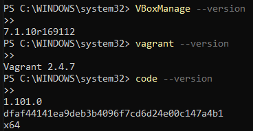

# Registro de Comandos e Resultados - Vagrant + Ansible + GitLab ✅

## Requisitos



## Clonando o repositório correto via SSH

```bash
git clone git@gitlab.com:dvp2025-2/aula-2-iac-com-vagrant-e-ansible.git
```

Resultado:

```bash

Cloning into 'aula-2-iac-com-vagrant-e-ansible'...
remote: Enumerating objects: 101, done.
remote: Counting objects: 100% (32/32), done.
remote: Compressing objects: 100% (32/32), done.
remote: Total 101 (delta 8), reused 0 (delta 0), pack-reused 69 (from 1)
Receiving objects: 100% (101/101), 19.24 MiB | 10.97 MiB/s, done.
Resolving deltas: 100% (20/20), done.
```

## Acessando o diretório do projeto

```bash
cd aula-2-iac-com-vagrant-e-ansible/
```

# Configuração do Vagrant

## Inicializando o Vagrant

```bash
vagrant init
```

Resultado:

```bash
A Vagrantfile has been placed in this directory. You are now
ready to vagrant up your first virtual environment! Please read
the comments in the Vagrantfile as well as documentation on
vagrantup.com for more information on using Vagrant.
```


## Subindo a VM 
```bash
$ vagrant up
```

Resultado:

```bash
Bringing machine 'default' up with 'virtualbox' provider...
==> default: Box 'hashicorp/bionic64' could not be found. Attempting to find and install...
    default: Box Provider: virtualbox
    default: Box Version: >= 0
==> default: Loading metadata for box 'hashicorp/bionic64'
    default: URL: https://vagrantcloud.com/api/v2/vagrant/hashicorp/bionic64
==> default: Adding box 'hashicorp/bionic64' (v1.0.282) for provider: virtualbox
    default: Downloading: https://vagrantcloud.com/hashicorp/boxes/bionic64/versions/1.0.282/providers/virtualbox/unknown/vagrant.box
    default:
==> default: Successfully added box 'hashicorp/bionic64' (v1.0.282) for 'virtualbox'!
==> default: Importing base box 'hashicorp/bionic64'...
==> default: Matching MAC address for NAT networking...
==> default: Checking if box 'hashicorp/bionic64' version '1.0.282' is up to date...
==> default: Setting the name of the VM: aula-2-iac-com-vagrant-e-ansible_default_1750446384302_81398
Vagrant is currently configured to create VirtualBox synced folders with
the SharedFoldersEnableSymlinksCreate option enabled. If the Vagrant
guest is not trusted, you may want to disable this option. For more
information on this option, please refer to the VirtualBox manual:

  https://www.virtualbox.org/manual/ch04.html#sharedfolders

This option can be disabled globally with an environment variable:

  VAGRANT_DISABLE_VBOXSYMLINKCREATE=1

or on a per folder basis within the Vagrantfile:

  config.vm.synced_folder '/host/path', '/guest/path', SharedFoldersEnableSymlinksCreate: false
==> default: Clearing any previously set network interfaces...
==> default: Preparing network interfaces based on configuration...
    default: Adapter 1: nat
==> default: Forwarding ports...
    default: 22 (guest) => 2222 (host) (adapter 1)
==> default: Booting VM...
==> default: Waiting for machine to boot. This may take a few minutes...
    default: SSH address: 127.0.0.1:2222
    default: SSH username: vagrant
    default: SSH auth method: private key
    default:
    default: Vagrant insecure key detected. Vagrant will automatically replace
    default: this with a newly generated keypair for better security.
    default:
    default: Inserting generated public key within guest...
    default: Removing insecure key from the guest if it's present...
    default: Key inserted! Disconnecting and reconnecting using new SSH key...
==> default: Machine booted and ready!
==> default: Checking for guest additions in VM...
    default: The guest additions on this VM do not match the installed version of
    default: VirtualBox! In most cases this is fine, but in rare cases it can
    default: prevent things such as shared folders from working properly. If you see
    default: shared folder errors, please make sure the guest additions within the
    default: virtual machine match the version of VirtualBox you have installed on
    default: your host and reload your VM.
    default:
    default: Guest Additions Version: 6.0.10
    default: VirtualBox Version: 7.1
==> default: Mounting shared folders...
    default: C:/Users/Leanderson/OneDrive/Documentos/GitHub/aula-2-iac-com-vagrant-e-ansible => /vagrant
```

## Provisionamento com Ansible


```bash
$ vagrant provision

```

Resultado:


```bash
==> default: Running provisioner: ansible_local...
    default: Installing Ansible...
Vagrant gathered an unknown Ansible version:


and falls back on the compatibility mode '1.8'.

Alternatively, the compatibility mode can be specified in your Vagrantfile:
https://www.vagrantup.com/docs/provisioning/ansible_common.html#compatibility_mode
    default: Running ansible-playbook...

PLAY [all] *********************************************************************

TASK [Gathering Facts] *********************************************************
[DEPRECATION WARNING]: Distribution Ubuntu 18.04 on host default should use
/usr/bin/python3, but is using /usr/bin/python for backward compatibility with
prior Ansible releases. A future Ansible release will default to using the
discovered platform python for this host. See https://docs.ansible.com/ansible/
2.9/reference_appendices/interpreter_discovery.html for more information. This
feature will be removed in version 2.12. Deprecation warnings can be disabled
by setting deprecation_warnings=False in ansible.cfg.
ok: [default]

TASK [Atualiza o cache do apt] *************************************************
changed: [default]
[WARNING]: Updating cache and auto-installing missing dependency: python-apt

TASK [Instala o Nginx] *********************************************************
changed: [default]

TASK [Copia a página web para o diretório do Nginx] ****************************
changed: [default]

RUNNING HANDLER [Reiniciar Nginx] **********************************************
changed: [default]

PLAY RECAP *********************************************************************
default                    : ok=5    changed=4    unreachable=0    failed=0    skipped=0    rescued=0    ignored=0
```

# Recarregar a VM com novas configurações

## Recarregar a VM

```bash
vagrant reload
```

Resultado:

```bash
==> default: Attempting graceful shutdown of VM...
==> default: Checking if box 'hashicorp/bionic64' version '1.0.282' is up to date...
==> default: Setting the name of the VM: nginx - webserver
==> default: Clearing any previously set forwarded ports...
==> default: Clearing any previously set network interfaces...
==> default: Preparing network interfaces based on configuration...
    default: Adapter 1: nat
==> default: Forwarding ports...
    default: 80 (guest) => 8080 (host) (adapter 1)
    default: 22 (guest) => 2222 (host) (adapter 1)
==> default: Running 'pre-boot' VM customizations...
==> default: Booting VM...
==> default: Waiting for machine to boot. This may take a few minutes...
    default: SSH address: 127.0.0.1:2222
    default: SSH username: vagrant
    default: SSH auth method: private key
==> default: Machine booted and ready!
==> default: Checking for guest additions in VM...
    default: The guest additions on this VM do not match the installed version of
    default: VirtualBox! In most cases this is fine, but in rare cases it can
    default: prevent things such as shared folders from working properly. If you see
    default: shared folder errors, please make sure the guest additions within the
    default: virtual machine match the version of VirtualBox you have installed on
    default: your host and reload your VM.
    default:
    default: Guest Additions Version: 6.0.10
    default: VirtualBox Version: 7.1
==> default: Mounting shared folders...
    default: C:/Users/Leanderson/OneDrive/Documentos/GitHub/aula-2-iac-com-vagrant-e-ansible => /vagrant
==> default: Machine already provisioned. Run vagrant provision or use the --provision
==> default: flag to force provisioning. Provisioners marked to run always will still run.
```

## Acesso via navegador:
Acesse:

http://localhost:8080/


## Encerrando (desligando) a VM

```bash
vagrant halt
```
Resultado:

```bash
==> default: Attempting graceful shutdown of VM...

```

## 👨‍💻 Sobre Mim

Olá! Eu sou **Leanderson Lima**, um desenvolvedor com experiência em **back-end (C#, .NET, Python, Ruby on Rails)** e **computação em nuvem (AWS, GCP)**. Atualmente, trabalho como **Analista de Infraestrutura**

- 🔭 **Atualmente trabalhando com:** AWS (EC2, WorkMail, Route 53, RDS), CloudFlare e .NET  
- 🌱 **Estudando:** Engenharia de Software na Univesp  
- 💡 **Interesses:** APIs escaláveis e automação com Terraform  
- 📫 **Contato:** [https://www.linkedin.com/in/leanderson-dias-de-lima/](https://www.linkedin.com/in/leanderson-dias-de-lima/)


